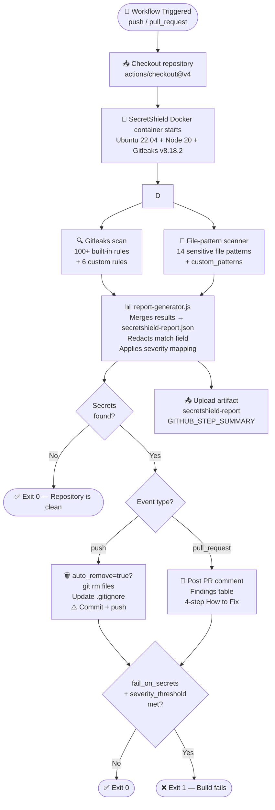

<div align="center">

# 🛡️ SecretShield

### Automated secret and sensitive-file detection for every push and PR

[](LICENSE)
[](https://github.com/marketplace/actions/secretshield)
[](https://github.com/gitleaks/gitleaks)
[](https://github.com/SKKammar/secretshield/actions/workflows/ci.yml)
[](CONTRIBUTING.md)
[](SECURITY.md)

</div>

---

## ⚡ Quick Start

Add this to `.github/workflows/secretshield.yml` in **any** repository and you're protected in under 5 minutes:

```yaml
name: SecretShield Scan

on:
  push:
    branches: [ main, master ]
  pull_request:
    branches: [ main, master ]
  repository_dispatch:
    types: [secretshield-scan]

permissions:
  contents: write      # required for auto-remove on push
  pull-requests: write # required to post PR comments

jobs:
  scan:
    runs-on: ubuntu-latest
    steps:
      - uses: actions/checkout@v4
        with:
          fetch-depth: 0
          persist-credentials: true

      - name: Run SecretShield
        uses: SKKammar/secretshield@v1.1.0
        with:
          token: ${{ secrets.GITHUB_TOKEN }}
          severity_threshold: "HIGH"
          auto_remove: "true"
          fail_on_secrets: "true"

      - name: Upload scan report
        if: always()
        uses: actions/upload-artifact@v4
        with:
          name: secretshield-report
          path: secretshield-report.json
```

### 🤖 Automated Multi-Repo Setup

If you want to automatically add the SecretShield workflow to **all** of your repositories at once, you can run our provided setup script:

**Using Node.js:**
```bash
curl -sO https://raw.githubusercontent.com/SKKammar/secretshield/main/scripts/add-workflow-to-all.js
GITHUB_TOKEN=your_pat_token node add-workflow-to-all.js
```
*(Requires a GitHub Personal Access Token with `repo` permissions)*

---

## 🔍 What It Does

- 🔐 **Detects secrets** using [Gitleaks v8.18.2](https://github.com/gitleaks/gitleaks) (pinned) with 100+ built-in rules
- 📁 **Scans sensitive file patterns**: `.env`, `.pem`, `.key`, `service-account.json`, `firebase-adminsdk*.json`, and [11 more](#sensitive-file-patterns)
- 🔴 **Blocks PR merges** by posting a detailed comment with findings and 4-step fix guide
- 🗑️ **Auto-removes** sensitive files on direct push, updates `.gitignore`, commits with ⚠️ warning
- 📊 **Generates a structured JSON report** uploaded as a named workflow artifact
- 🛡️ **Native GitHub Code Scanning** support via SARIF upload (`sarif_upload: true`)
- 🎛️ **Configurable severity threshold** — fail only on CRITICAL, HIGH, MEDIUM, or any finding
- 🔒 **Redacts secrets** — the `match` field logs only the first 4 characters + `****`
- 🧩 **Extensible** via `custom_patterns` (regex) and `ignore_paths`
- 📈 **Terminal Dashboard** — visualize scan history across all repos ([see below](#-dashboard))

---

## 📥 Inputs

| Input | Required | Default | Description |
|-------|----------|---------|-------------|
| `token` | ✅ | `${{ github.token }}` | GitHub token for PR comments and artifact upload |
| `auto_remove` | ❌ | `"true"` | Auto-delete sensitive files on direct push and commit |
| `fail_on_secrets` | ❌ | `"true"` | Fail the job if secrets at or above `severity_threshold` are found |
| `custom_patterns` | ❌ | `""` | Comma-separated extra regex patterns to scan file contents for |
| `ignore_paths` | ❌ | `""` | Comma-separated paths to skip entirely (e.g. `tests/,docs/`) |
| `sarif_upload` | ❌ | `"false"` | Upload findings to GitHub Code Scanning Alerts |
| `severity_threshold` | ❌ | `"HIGH"` | Minimum severity to trigger failure: `LOW` \| `MEDIUM` \| `HIGH` \| `CRITICAL` |

---

## 📤 Outputs

| Output | Description |
|--------|-------------|
| `secrets_found` | `"true"` or `"false"` — whether any secrets were detected |
| `total_findings` | Total number of findings across all rules and scanners |
| `report_path` | Absolute path to the generated JSON scan report |

**Using outputs in subsequent steps:**

```yaml
- name: Run SecretShield
  id: scan
  uses: SKKammar/secretshield@v1.1.0

- name: Check results
  run: |
    echo "Secrets found: ${{ steps.scan.outputs.secrets_found }}"
    echo "Total findings: ${{ steps.scan.outputs.total_findings }}"
```

---

## ⚙️ How It Works

> **Dogfooding:** SecretShield scans its own repository on every push and PR.



---

## 📈 Dashboard

Visualize scan history across all your repositories with the companion Next.js 15 **Terminal Security Console** dashboard.

> **No backend, no database** — reads directly from the GitHub Artifacts REST API using your Personal Access Token (`read:actions` scope).

**Features:**
- 📋 **Terminal aesthetic:** Monospace fonts, strict layout, and zero fluff
- 📉 **30-day findings trend chart:** Jagged data visualizations
- 🥧 **Severity breakdowns & raw readouts**
- 🔎 **Single scan detail view** with local `report.json` Blob downloads
- 🔐 **Secure PAT onboarding:** Inline guides, credentials never leave your browser

[](https://vercel.com/new/clone?repository-url=https://github.com/SKKammar/secretshield/tree/main/dashboard)

---

## 🎯 Severity Levels

| Severity | Badge | Examples | Action Taken |
|----------|-------|----------|-------------|
| **CRITICAL** | 🔴 | Private keys (`-----BEGIN * PRIVATE KEY-----`), database connection strings with credentials, Supabase service_role keys, `service-account.json` | Always fails build when `fail_on_secrets=true` |
| **HIGH** | 🟠 | Generic API key assignments, password assignments, `.env` files, Firebase admin keys | Fails build when `severity_threshold=HIGH` (default) |
| **MEDIUM** | 🟡 | Supabase project URLs, suspicious endpoints | Fails build when `severity_threshold=MEDIUM` |
| **LOW** | 🔵 | Informational findings | Fails build when `severity_threshold=LOW` |

### Sensitive File Patterns

These file types are detected regardless of content:

`.env` · `.env.*` · `.pem` · `.key` · `.p12` · `.pfx` · `id_rsa*` · `id_dsa*` · `id_ecdsa*` · `id_ed25519*` · `secrets.json` · `secrets.yaml` · `secrets.yml` · `credentials.json` · `service-account.json` · `firebase-adminsdk*.json` · `google-credentials.json`

---

## 🧩 Custom Patterns

Extend SecretShield's detection with your own regex patterns via the `custom_patterns` input:

```yaml
- uses: SKKammar/secretshield@v1.1.0
  with:
    token: ${{ secrets.GITHUB_TOKEN }}
    custom_patterns: "MYAPP_SECRET=[A-Za-z0-9]{32},internal_token_[a-z]+"
    ignore_paths: "tests/,scripts/seed.sh"
```

- **`custom_patterns`**: Comma-separated list of regex patterns scanned against file *contents*
- **`ignore_paths`**: Comma-separated list of path prefixes to skip entirely

---

## ⚠️ Important — Read Before Using

> **Deleting a file does NOT remove it from git history.**

When SecretShield's `auto_remove` feature removes a file and commits the deletion, the secret still exists in all previous commits. Anyone with repository access can still check out an older commit and read the file.

> **`auto_remove` scope**: Only **whole sensitive files** detected by the file-pattern scanner (`.env`, `.pem`, `service-account.json`, etc.) are auto-deleted. Secrets embedded inside regular source files (e.g. a hardcoded API key in `config.js`) are **flagged but never auto-deleted** — removing a source file would break your codebase. You must edit the file to remove the secret value.

**After any secret detection, you MUST:**

1. **Rotate credentials immediately** — assume the secret is compromised.
2. **Purge git history** using [`git-filter-repo`](https://github.com/newren/git-filter-repo):
   ```bash
   pip install git-filter-repo
   git filter-repo --path path/to/secret-file --invert-paths
   git push --force-with-lease origin main
   ```
3. **Notify your security team** if the repo is or was ever public.
4. **Audit access logs** for the exposed service.

---

## 🤝 Contributing

Contributions are welcome! Please:

1. Fork the repository
2. Create a feature branch: `git checkout -b feat/my-feature`
3. Make your changes and add tests in `tests/fixtures/`
4. Submit a pull request — SecretShield will scan your PR automatically 🛡️

Please read [CHANGELOG.md](CHANGELOG.md) for the project history.

---

## 📄 License

[MIT License](LICENSE) — Copyright © 2026 [SKKammar](https://github.com/SKKammar)

Please see [SECURITY.md](SECURITY.md) for responsible disclosure instructions.

---

<div align="center">

Made with ❤️ by [SKKammar](https://github.com/SKKammar) · [Report a Bug](https://github.com/SKKammar/secretshield/issues) · [Request a Feature](https://github.com/SKKammar/secretshield/issues)

</div>
