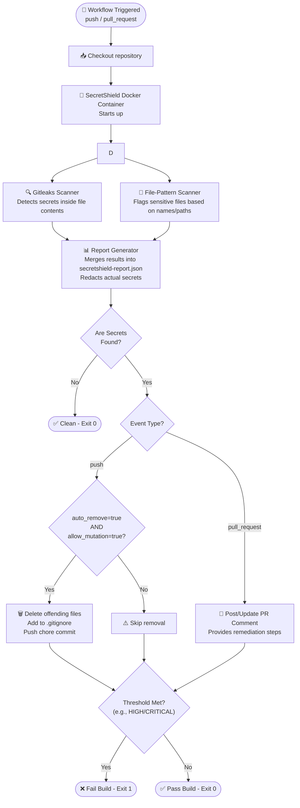

# 🛡️ SecretShield

**SecretShield** is a powerful, automated secret detection and remediation suite designed for GitHub. It seamlessly integrates into your CI/CD pipelines to prevent sensitive data—like API keys, private keys, and `.env` files—from leaking into your repositories. 

Beyond just a GitHub Action, SecretShield includes a **Terminal Security Console** (a Next.js dashboard) to visualize scan histories across all your organizations and repositories without requiring a backend database.

---

## ⚡ Key Features

- 🔐 **Deep Secret Detection**: Powered by [Gitleaks v8.18.2](https://github.com/gitleaks/gitleaks), scanning with over 100+ built-in rules.
- 📁 **Targeted File Scanning**: Explicitly targets high-risk file patterns (e.g., `.env`, `.pem`, `service-account.json`) regardless of their internal contents.
- 🗑️ **Auto-Remediation**: Can automatically remove sensitive files on direct pushes, update `.gitignore`, and commit the fixes.
- 💬 **PR Interception**: Automatically posts detailed, formatted comments on Pull Requests outlining the findings and how to fix them, blocking the merge.
- 📊 **Unified Reporting**: Merges results from all scanners into a single, standardized JSON report artifact.
- 📈 **No-DB Dashboard**: A companion Next.js web application that reads directly from the GitHub Artifacts API to give you a bird's-eye view of your security posture.

---

## ⚙️ Detailed Workflow: How It Works

SecretShield is designed to be lightweight but comprehensive. Here is exactly what happens when a workflow is triggered:



### 1. The Scanning Phase
Upon triggering, the action runs two distinct scanners simultaneously:
- **Gitleaks Scanner**: Reads through the commit history and file contents to identify hardcoded secrets (tokens, passwords) using regex rules.
- **File-Pattern Scanner**: Fast file-tree traversal identifying structural files that should never be committed (like `.env`, `credentials.json`, `*.pem`), regardless of their contents.

### 2. Report Unification & Redaction
The outputs of both scanners are piped into `report-generator.js`. This script standardizes the findings, assigns severity levels (LOW, MEDIUM, HIGH, CRITICAL), **redacts the actual matched secrets** (replacing them with `[REDACTED:<hash>]` for safety), and outputs a unified `secretshield-report.json`.

### 3. Action Phase (Push vs. PR)
- **Pull Requests**: SecretShield posts a PR comment detailing the leaked secrets and provides a 4-step remediation guide. It blocks the PR from merging if the severity meets the threshold.
- **Direct Pushes (Auto-Remove)**: If `auto_remove: true` and `allow_mutation: true` are configured, SecretShield will aggressively protect the repository by automatically executing `git rm` on the offending files, updating the `.gitignore`, and pushing a `chore(secretshield)` commit to physically remove the files from the working tree.

### 4. Upload & Dashboard Integration
Regardless of the outcome, the `secretshield-report.json` is uploaded as a GitHub Action Artifact. The **Terminal Security Console** later queries the GitHub API to download these artifacts, unpack them, and visualize the data.

---

## 🚀 Quick Start

To protect a repository, simply add the following workflow file to `.github/workflows/secretshield.yml`:

```yaml
name: SecretShield Scan

on:
  push:
  pull_request:
  repository_dispatch:
    types: [secretshield-scan]

permissions:
  contents: write      # Required for auto-remove on push
  pull-requests: write # Required to post PR comments
  security-events: write # Required for SARIF upload

jobs:
  scan:
    runs-on: ubuntu-latest
    steps:
      - uses: actions/checkout@v4
        with:
          fetch-depth: 0
          persist-credentials: true

      - name: Run SecretShield
        uses: SKKammar/secretshield@main
        with:
          token: ${{ secrets.GITHUB_TOKEN }}
          severity_threshold: "HIGH"
          auto_remove: "true"
          allow_mutation: "true"
          fail_on_secrets: "true"
          request_id: ${{ github.event.client_payload.request_id }}

      - name: Upload scan report
        if: always()
        uses: actions/upload-artifact@v4
        with:
          name: secretshield-report
          path: secretshield-report.json
```

---

## 🛠️ Configuration Inputs

| Input | Required | Default | Description |
|-------|----------|---------|-------------|
| `token` | ✅ | `${{ github.token }}` | GitHub token for PR comments and artifact upload |
| `auto_remove` | ❌ | `"false"` | Auto-delete sensitive files on direct push and commit (requires `allow_mutation: "true"`) |
| `allow_mutation` | ❌ | `"false"` | Explicitly allow mutating the repository on push (safety flag for `auto_remove`) |
| `fail_on_secrets` | ❌ | `"true"` | Fail the job if secrets at or above `severity_threshold` are found |
| `custom_patterns` | ❌ | `""` | Comma-separated extra regex patterns to scan file contents for |
| `ignore_paths` | ❌ | `""` | Comma-separated paths to skip entirely (e.g. `tests/,docs/`) |
| `severity_threshold` | ❌ | `"HIGH"` | Minimum severity to trigger failure: `LOW` \| `MEDIUM` \| `HIGH` \| `CRITICAL` |

---

## 🤖 Automated Multi-Repo Installation

If you manage an organization or have dozens of repositories, manually copying workflow files is tedious. SecretShield provides a Node.js script to automatically deploy itself to all your repositories.

```bash
# Download the script
curl -sO https://raw.githubusercontent.com/SKKammar/secretshield/main/scripts/add-workflow-to-all.js

# Run the script (Requires a GitHub Personal Access Token with 'repo' permissions)
GITHUB_TOKEN=your_pat_token node add-workflow-to-all.js
```

---

## ⚠️ Important: Limitations of Auto-Remove

> **Deleting a file does NOT remove it from git history.**

When SecretShield's `auto_remove` feature deletes a file and commits the deletion, the secret is removed from the *current* state of the code, but it **still exists in all previous commits**. Anyone who checks out an older commit can still read the leaked file.

**Furthermore, `auto_remove` only deletes whole files flagged by the file-pattern scanner** (like an entire `.env` file). If a secret is embedded inside a regular source code file (e.g., a hardcoded API key inside `src/config.js`), the file is flagged but **never auto-deleted**, as doing so would break your application.

**If SecretShield detects a leak, you MUST:**
1. **Rotate the credentials immediately** (treat them as compromised).
2. **Purge the git history** using [git-filter-repo](https://github.com/newren/git-filter-repo).

---

## 📈 Terminal Security Console (Dashboard)

SecretShield includes a Next.js 15 dashboard built with a sleek, zero-fluff terminal aesthetic. It visualizes the security status of your repositories without requiring a database or backend server. 

**Features:**
- **Zero Configuration**: Just log in with GitHub OAuth (requires `repo` and `workflow` scopes).
- **Real-Time Data**: Queries the GitHub API dynamically to unpack ZIP artifacts.
- **Severity Breakdowns**: Instantly see CRITICAL, HIGH, MEDIUM, and LOW issues across all repositories.

To run the dashboard locally:
```bash
cd dashboard
npm install
npm run dev
```

---

<div align="center">
Made with ❤️ by SKKammar
</div>
